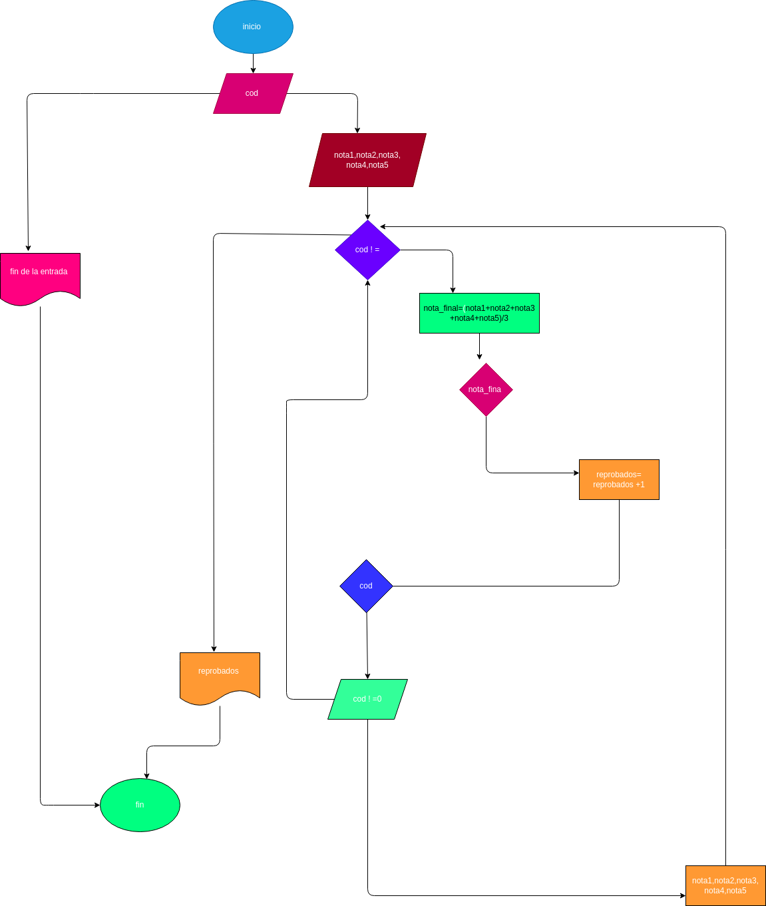

### programa para calcular las 5 notas de una materia y la definitiva.

### CENTINELA

Qué es:

es un valor especial utilizado para señalar el final de una lista de datos. El valor elegido debe ser totalmente distinto de los posibles valores de la lista para que se pueda utilizar para señalar el final de la lista.

su funcioń:

Los bucles controlados por centinela se utilizan cuando no se sabe con anticipación, el número exacto de iteraciones a realizar. Existen dos técnicas para realizar este bucle controlado por condición: Bucle controlado por el usuario.